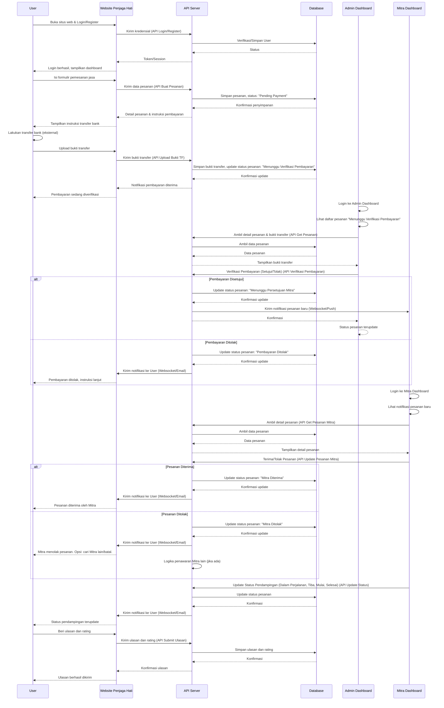

# PRD — Project Requirements Document

## 1. Overview
"penjaga hati" adalah sebuah platform web inovatif yang didesain untuk menjembatani kesenjangan antara keluarga pasien dan kebutuhan pendampingan di rumah sakit. Tujuan utama aplikasi ini adalah untuk memberikan solusi yang mudah diakses dan terpercaya bagi keluarga yang tidak dapat mendampingi anggota keluarganya yang sakit karena berbagai alasan (pekerjaan, jarak, keterbatasan waktu, dll.).

**Masalah yang Diselesaikan:**
Banyak keluarga mengalami kesulitan dalam menyediakan pendampingan pasien secara terus-menerus di rumah sakit. Keterbatasan waktu, sumber daya, atau bahkan kurangnya pengetahuan tentang cara mendapatkan pendamping yang terpercaya menjadi hambatan. Hal ini dapat menimbulkan kekhawatiran dan stres bagi keluarga, serta potensi penurunan kualitas perhatian yang diterima pasien.

**Deskripsi Sistem:**
"penjaga hati" akan menjadi situs web yang memungkinkan pengguna untuk dengan mudah memesan jasa pendamping pasien profesional (Mitra) untuk mendampingi kerabat mereka di rumah sakit. Sistem ini akan mencakup fitur pendaftaran pengguna dan mitra, pembuatan pesanan yang detail, proses pembayaran yang aman, verifikasi pembayaran oleh admin, manajemen mitra, serta pelaporan komprehensif untuk pemilik. Dengan berbagai peran pengguna (User, Mitra, Admin, CS, Owner), platform ini bertujuan untuk menciptakan ekosistem pendampingan pasien yang efisien, transparan, dan dapat diandalkan.

## 2. Requirements
### 2.1. Persyaratan Tingkat Tinggi (High-Level Requirements)
*   **Skalabilitas:** Sistem harus mampu menangani peningkatan jumlah pengguna, mitra, dan pesanan seiring waktu.
*   **Keamanan:** Data pengguna, pasien, dan transaksi harus dilindungi dengan standar keamanan tertinggi. Autentikasi dan otorisasi yang kuat untuk setiap peran pengguna.
*   **Ketersediaan (Availability):** Platform harus memiliki uptime yang tinggi untuk memastikan layanan selalu dapat diakses.
*   **Performa:** Aplikasi harus responsif dan cepat dalam memproses permintaan pengguna, terutama pada alur pemesanan dan verifikasi.
*   **Kemudahan Penggunaan (Usability):** Antarmuka pengguna (UI) harus intuitif dan mudah dipahami oleh semua segmen pengguna.
*   **Real-time:** Notifikasi dan pembaruan status pesanan harus mendekati real-time.

### 2.2. Aksesibilitas
*   Aplikasi akan diimplementasikan sebagai situs web responsif, yang dapat diakses melalui berbagai perangkat (desktop, tablet, smartphone) dengan pengalaman pengguna yang optimal.
*   Desain UI/UX akan mempertimbangkan prinsip-prinsip aksesibilitas dasar (kontras warna, ukuran font yang dapat diatur, navigasi keyboard) untuk memastikan penggunaan yang nyaman bagi sebanyak mungkin pengguna.

### 2.3. Target Pengguna Utama
1.  **User (Pelanggan/Keluarga Pasien):** Individu atau keluarga yang membutuhkan jasa pendamping pasien di rumah sakit.
2.  **Mitra (Pendamping Pasien Profesional):** Individu yang menawarkan jasa pendampingan pasien.
3.  **Admin:** Staf operasional yang mengelola dan memverifikasi pesanan serta mitra.
4.  **CS (Customer Service):** Staf yang melayani pertanyaan dan keluhan pelanggan.
5.  **Owner:** Pemilik bisnis yang memantau kinerja keseluruhan dan aspek finansial.

### 2.4. Jenis Input Data
*   **User:** Data pendaftaran (nama, email, telepon, password), informasi pasien (nama, usia, kondisi umum, rumah sakit, kamar), durasi pendampingan, bukti transfer pembayaran, ulasan/kritik.
*   **Mitra:** Data pendaftaran (nama, email, telepon, password, KTP, skill/pengalaman, rekening bank), status ketersediaan.
*   **Admin:** Data verifikasi pembayaran, status mitra, respons ulasan.
*   **CS:** Detail pertanyaan/keluhan pelanggan, jawaban/solusi.
*   **Owner:** Parameter sistem, laporan keuangan.

### 2.5. Batasan atau Aturan Spesifik
*   **Verifikasi Pembayaran Manual:** Untuk rilis awal (MVP), verifikasi pembayaran akan dilakukan secara manual oleh Admin setelah User mengunggah bukti transfer.
*   **Pembayaran Hanya Transfer Bank:** Metode pembayaran awal hanya melalui transfer bank yang telah ditentukan.
*   **Durasi Pendampingan:** Minimum durasi pendampingan akan ditentukan (misalnya, minimal 4 jam).
*   **Persetujuan Mitra:** Mitra baru harus disetujui oleh Admin sebelum dapat menerima pesanan.
*   **Geolokasi:** Pada rilis awal, pemilihan Mitra mungkin terbatas pada Mitra yang telah terdaftar di rumah sakit yang dituju tanpa fitur geolokasi real-time yang kompleks.
*   **Kebijakan Pembatalan:** Harus ada kebijakan yang jelas mengenai pembatalan pesanan oleh User atau Mitra.

## 3. Core Features
Berikut adalah daftar fitur kunci untuk rilis pertama (MVP) aplikasi "penjaga hati":

### 3.1. Modul Pengguna (User)
*   **Pendaftaran & Login Pengguna:**
    *   Pengguna dapat mendaftar dengan email/nomor telepon dan password.
    *   Verifikasi email/nomor telepon (opsional untuk MVP).
    *   Pengguna dapat login dan logout.
    *   Fitur lupa password.
*   **Pencarian & Pemilihan Mitra:**
    *   Pengguna dapat melihat daftar Mitra yang tersedia.
    *   Penyaringan Mitra berdasarkan rumah sakit, rating, atau ketersediaan.
    *   Detail profil Mitra (nama, rating, pengalaman, foto).
*   **Formulir Pemesanan Jasa:**
    *   Input informasi pasien: nama, jenis kelamin, usia.
    *   Pemilihan rumah sakit dari daftar yang tersedia.
    *   Input nomor kamar/bangsal (opsional, jika relevan).
    *   Detail kondisi umum pasien (teks singkat).
    *   Pemilihan tanggal dan jam mulai pendampingan.
    *   Pemilihan durasi pendampingan (8 jam, 12 jam, 24 jam).
    *   Pilihan untuk memilih Mitra spesifik atau "Pilih Mitra Terbaik" (sistem memilih otomatis berdasarkan ketersediaan/rating).
*   **Proses Pembayaran:**
    *   Rekapitulasi biaya layanan setelah mengisi formulir.
    *   Instruksi pembayaran melalui transfer bank (daftar bank dan nomor rekening).
    *   Formulir untuk mengunggah bukti transfer (gambar/screenshot).
*   **Manajemen Pesanan:**
    *   Melihat status pesanan aktif (Menunggu Verifikasi Pembayaran, Menunggu Persetujuan Mitra, Dalam Proses, Selesai, Dibatalkan).
    *   Melihat riwayat pesanan yang telah selesai.
*   **Ulasan & Kritik:**
    *   Memberikan rating dan ulasan kepada Mitra setelah pesanan selesai.
    *   Mengajukan kritik atau keluhan terkait layanan.

### 3.2. Modul Mitra (Pendamping)
*   **Pendaftaran & Login Mitra:**
    *   Pendaftaran awal dengan data diri, kontak, pengalaman.
    *   **Verifikasi Admin:** Mitra baru harus diverifikasi dan disetujui oleh Admin sebelum dapat menerima pesanan.
    *   Login dan logout.
*   **Manajemen Profil Mitra:**
    *   Mengatur status ketersediaan (Aktif/Non-aktif, jam kerja).
    *   Mengunggah dokumen pendukung (KTP, sertifikat keahlian - diverifikasi Admin).
    *   Mengelola informasi profil publik (bio, keahlian).
*   **Penerimaan Pesanan:**
    *   Melihat daftar pesanan baru yang masuk (notifikasi).
    *   Melihat detail pesanan (info pasien, rumah sakit, durasi, biaya).
    *   **Menerima/Menolak** pesanan dalam batas waktu tertentu.
*   **Pembaruan Status Pesanan:**
    *   Mengubah status pesanan: "Dalam Perjalanan", "Tiba di Lokasi", "Mulai Pendampingan", "Selesai Pendampingan".
*   **Riwayat Pendapatan:**
    *   Melihat riwayat pesanan yang telah diselesaikan dan estimasi pendapatan.

### 3.3. Modul Admin
*   **Dashboard Admin:**
    *   Ikhtisar pesanan aktif, pesanan baru, mitra terverifikasi, pembayaran tertunda.
*   **Verifikasi Pembayaran:**
    *   Melihat daftar pesanan dengan status "Menunggu Verifikasi Pembayaran".
    *   Melihat bukti transfer yang diunggah User.
    *   **Menyetujui/Menolak** pembayaran. Jika ditolak, notifikasi ke User.
*   **Manajemen Mitra:**
    *   Melihat daftar Mitra terdaftar (aktif/non-aktif).
    *   **Verifikasi & Menyetujui** pendaftaran Mitra baru.
    *   Mengaktifkan/menonaktifkan akun Mitra.
    *   Melihat profil detail Mitra.
*   **Pemantauan Pesanan:**
    *   Melihat semua pesanan aktif dengan status terkini.
    *   Melihat detail lengkap setiap pesanan (User, Mitra, Pasien, Rumah Sakit, Status).
*   **Manajemen User:**
    *   Melihat daftar pengguna terdaftar.
    *   Menonaktifkan/mengaktifkan akun pengguna (jika ada pelanggaran).
*   **Manajemen Ulasan & Kritik:**
    *   Melihat daftar ulasan dan kritik dari pelanggan.
    *   **Menanggapi** ulasan/kritik (terlihat oleh User).
    *   Memoderasi konten ulasan yang tidak pantas.

### 3.4. Modul Customer Service (CS)
*   **Manajemen Kontak Pelanggan:**
    *   Melihat daftar pertanyaan atau keluhan yang masuk (via form web atau rekaman telepon).
    *   Mencatat interaksi dengan pelanggan (via pesan/telepon).
*   **Akses Data Dukungan:**
    *   Melihat detail pesanan dan profil User/Mitra (hanya yang relevan untuk dukungan) untuk membantu penyelesaian masalah.
    *   Menyediakan informasi terkait layanan.

### 3.5. Modul Owner
*   **Dashboard Owner:**
    *   Ikhtisar kinerja bisnis: total pendapatan, jumlah pesanan, jumlah Mitra aktif, pertumbuhan pengguna.
*   **Laporan Keuangan:**
    *   Melihat laporan pendapatan (bersih, kotor), pengeluaran, pembayaran ke Mitra.
    *   Filter laporan berdasarkan periode waktu.
*   **Pengaturan Keuangan:**
    *   Mengelola detail rekening bank untuk pembayaran dan pencairan.
    *   Menentukan struktur biaya layanan atau komisi Mitra (jika ada).
*   **Laporan Operasional:**
    *   Laporan aktivitas Mitra (jumlah pesanan selesai, rating rata-rata).
    *   Laporan aktivitas User (jumlah pesanan, frekuensi).
*   **Pengaturan Sistem (High-Level):**
    *   Mengelola daftar rumah sakit yang tersedia.
    *   Pengaturan umum aplikasi.

## 4. User Flow
Berikut adalah alur kerja utama pengguna (User) dalam memesan jasa pendamping pasien:

1.  User membuka situs web "penjaga hati" di browser.
2.  User melakukan pendaftaran akun baru atau login menggunakan kredensial yang sudah ada.
3.  Setelah login, User diarahkan ke halaman utama atau dashboard.
4.  User menavigasi ke halaman "Pesan Jasa Penjaga" atau "Buat Pesanan Baru".
5.  User mengisi formulir pemesanan dengan informasi yang diperlukan:
    *   Nama Pasien
    *   Rumah Sakit Tujuan (memilih dari daftar)
    *   Nomor Kamar/Bangsal (opsional)
    *   Kondisi Umum Pasien (deskripsi singkat)
    *   Tanggal Mulai Pendampingan
    *   Jam Mulai Pendampingan
    *   Durasi Pendampingan (misal: 4 jam, 8 jam, 12 jam)
6.  Sistem menampilkan daftar Mitra yang tersedia sesuai kriteria pesanan (rumah sakit, waktu, durasi). User dapat melihat detail profil Mitra seperti rating, pengalaman, dan foto.
7.  User memilih satu Mitra dari daftar yang ditampilkan, atau memilih opsi "Pilih Mitra Terbaik" jika tidak memiliki preferensi spesifik.
8.  Sistem menampilkan rekapitulasi pesanan dan total biaya yang harus dibayar.
9.  User mengkonfirmasi pesanan dan melanjutkan ke halaman pembayaran.
10. Sistem menampilkan instruksi pembayaran, termasuk nomor rekening bank tujuan dan nama bank.
11. User melakukan transfer pembayaran dari rekening banknya ke rekening "penjaga hati" di luar sistem.
12. User kembali ke halaman "penjaga hati" dan mengunggah bukti transfer (berupa gambar atau screenshot) pada formulir yang disediakan.
13. User mengklik tombol "Selesaikan Pembayaran" atau "Kirim Bukti Transfer".
14. Sistem menandai status pesanan sebagai "Menunggu Verifikasi Pembayaran" dan mengirimkan notifikasi ke User bahwa pesanan sedang diproses.
15. **[Alur Admin]**: Admin menerima notifikasi adanya pembayaran baru yang perlu diverifikasi. Admin memeriksa bukti transfer yang diunggah dan memverifikasi pembayaran dengan mutasi bank.
16. **[Alur Admin]**: Jika pembayaran valid, Admin menyetujui pembayaran. Jika tidak valid, Admin menolak pembayaran dan User akan menerima notifikasi untuk mengunggah bukti yang benar atau menghubungi CS.
17. Setelah pembayaran disetujui oleh Admin, sistem secara otomatis:
    *   Mengubah status pesanan menjadi "Menunggu Persetujuan Mitra".
    *   Mengirim notifikasi pesanan baru ke Mitra yang dipilih (jika belum terpilih, sistem memilih Mitra dan mengirim notifikasi).
18. **[Alur Mitra]**: Mitra menerima notifikasi pesanan baru. Mitra melihat detail pesanan.
19. **[Alur Mitra]**: Mitra menerima atau menolak pesanan dalam batas waktu yang ditentukan.
20. Sistem mengirimkan notifikasi kepada User mengenai status pesanan: "Mitra Telah Menerima Pesanan" atau "Mitra Menolak Pesanan" (jika ditolak, sistem dapat menawarkan Mitra lain atau opsi pembatalan/refund).
21. Pada hari dan waktu yang ditentukan, Mitra memulai perjalanan ke rumah sakit. Mitra memperbarui status menjadi "Dalam Perjalanan".
22. User menerima notifikasi "Mitra Sedang Dalam Perjalanan".
23. Mitra tiba di rumah sakit dan memulai pendampingan pasien. Mitra memperbarui status menjadi "Mulai Pendampingan".
24. User menerima notifikasi "Pendampingan Telah Dimulai".
25. Setelah durasi pendampingan selesai, Mitra memperbarui status menjadi "Selesai Pendampingan".
26. User menerima notifikasi "Pendampingan Telah Selesai".
27. User dapat memberikan rating dan ulasan kepada Mitra atas pelayanan yang diberikan.

## 5. Architecture


## 6. Database Schema
```mermaid
erDiagram
    USERS {
        UUID id PK
        VARCHAR nama
        VARCHAR email UNIQUE
        VARCHAR password_hash
        VARCHAR telepon UNIQUE
        TIMESTAMP registered_at
        ENUM role DEFAULT('user')
        BOOLEAN is_active DEFAULT(TRUE)
    }

    MITRAS {
        UUID id PK
        UUID user_id FK "REFERENCES USERS"
        VARCHAR bio
        VARCHAR experience
        DECIMAL rating DEFAULT(0.0)
        INT total_reviews DEFAULT(0)
        VARCHAR bank_account_name
        VARCHAR bank_account_number
        VARCHAR bank_name
        BOOLEAN is_verified DEFAULT(FALSE)
        BOOLEAN is_available DEFAULT(TRUE)
        TIMESTAMP verified_at
    }

    HOSPITALS {
        UUID id PK
        VARCHAR nama_rs UNIQUE
        VARCHAR alamat
        VARCHAR kota
    }

    ORDERS {
        UUID id PK
        UUID user_id FK "REFERENCES USERS"
        UUID mitra_id FK "REFERENCES MITRAS"
        UUID hospital_id FK "REFERENCES HOSPITALS"
        VARCHAR pasien_nama
        VARCHAR pasien_kondisi_umum
        DATE start_date
        TIME start_time
        INT duration_hours
        DECIMAL total_amount
        ENUM status DEFAULT('pending_payment')
        TIMESTAMP created_at
        TIMESTAMP updated_at
        VARCHAR room_number
    }

    PAYMENTS {
        UUID id PK
        UUID order_id FK "REFERENCES ORDERS"
        DECIMAL amount
        ENUM method DEFAULT('bank_transfer')
        VARCHAR bank_name_from
        VARCHAR bank_account_name_from
        VARCHAR proof_of_transfer_url
        ENUM status DEFAULT('pending')
        UUID verified_by_admin_id FK "REFERENCES USERS"
        TIMESTAMP created_at
        TIMESTAMP verified_at
    }

    REVIEWS {
        UUID id PK
        UUID order_id FK "REFERENCES ORDERS"
        UUID user_id FK "REFERENCES USERS"
        UUID mitra_id FK "REFERENCES MITRAS"
        INT rating
        TEXT comment
        TIMESTAMP created_at
    }

    INQUIRIES {
        UUID id PK
        UUID user_id FK "REFERENCES USERS"
        VARCHAR subject
        TEXT message
        ENUM status DEFAULT('open')
        UUID handled_by_cs_id FK "REFERENCES USERS"
        TIMESTAMP created_at
        TIMESTAMP resolved_at
    }

    USERS ||--o{ MITRAS : "has"
    USERS ||--o{ ORDERS : "places"
    MITRAS ||--o{ ORDERS : "takes"
    HOSPITALS ||--o{ ORDERS : "at"
    ORDERS ||--|| PAYMENTS : "has one"
    ORDERS ||--o{ REVIEWS : "can be reviewed"
    USERS ||--o{ INQUIRIES : "sends"
    USERS }|--o{ PAYMENTS : "verified by"
    USERS }|--o{ INQUIRIES : "handled by"
```

### Penjelasan Tabel (Dictionary)

| Nama Tabel    | Kolom                 | Tipe Data      | Deskripsi                                                                    | Keterangan                                                                |
| :------------ | :-------------------- | :------------- | :--------------------------------------------------------------------------- | :------------------------------------------------------------------------ |
| `USERS`       | `id`                  | UUID           | Primary Key, ID unik untuk setiap pengguna.                                  | Otomatis, unik                                                            |
|               | `nama`                | VARCHAR(255)   | Nama lengkap pengguna.                                                       | Wajib diisi                                                               |
|               | `email`               | VARCHAR(255)   | Alamat email pengguna, harus unik.                                           | Wajib diisi, unik                                                         |
|               | `password_hash`       | VARCHAR(255)   | Hash dari password pengguna.                                                 | Wajib diisi, aman                                                         |
|               | `telepon`             | VARCHAR(20)    | Nomor telepon pengguna, harus unik.                                          | Wajib diisi, unik                                                         |
|               | `registered_at`       | TIMESTAMP      | Waktu pendaftaran pengguna.                                                  | Otomatis                                                                  |
|               | `role`                | ENUM           | Peran pengguna (user, admin, mitra, cs, owner).                              | Default 'user'                                                            |
|               | `is_active`           | BOOLEAN        | Status akun aktif/tidak aktif.                                               | Default TRUE                                                              |
| `MITRAS`      | `id`                  | UUID           | Primary Key, ID unik untuk setiap mitra.                                     | Otomatis, unik                                                            |
|               | `user_id`             | UUID           | Foreign Key ke tabel USERS (peran mitra).                                    | Wajib diisi, unik ke USERS                                                |
|               | `bio`                 | TEXT           | Deskripsi singkat tentang mitra.                                             | Opsional                                                                  |
|               | `experience`          | TEXT           | Detail pengalaman kerja mitra.                                               | Opsional                                                                  |
|               | `rating`              | DECIMAL(2,1)   | Rating rata-rata dari ulasan pelanggan.                                      | Default 0.0                                                               |
|               | `total_reviews`       | INT            | Jumlah total ulasan yang diterima mitra.                                     | Default 0                                                                 |
|               | `bank_account_name`   | VARCHAR(255)   | Nama pemilik rekening bank mitra.                                            | Wajib diisi                                                               |
|               | `bank_account_number` | VARCHAR(50)    | Nomor rekening bank mitra.                                                   | Wajib diisi                                                               |
|               | `bank_name`           | VARCHAR(100)   | Nama bank mitra.                                                             | Wajib diisi                                                               |
|               | `is_verified`         | BOOLEAN        | Status verifikasi mitra oleh admin.                                          | Default FALSE                                                             |
|               | `is_available`        | BOOLEAN        | Status ketersediaan mitra untuk menerima pesanan.                            | Default TRUE                                                              |
|               | `verified_at`         | TIMESTAMP      | Waktu mitra diverifikasi.                                                    | Opsional                                                                  |
| `HOSPITALS`   | `id`                  | UUID           | Primary Key, ID unik untuk setiap rumah sakit.                               | Otomatis, unik                                                            |
|               | `nama_rs`             | VARCHAR(255)   | Nama rumah sakit, harus unik.                                                | Wajib diisi, unik                                                         |
|               | `alamat`              | TEXT           | Alamat lengkap rumah sakit.                                                  | Wajib diisi                                                               |
|               | `kota`                | VARCHAR(100)   | Kota lokasi rumah sakit.                                                     | Wajib diisi                                                               |
| `ORDERS`      | `id`                  | UUID           | Primary Key, ID unik untuk setiap pesanan.                                   | Otomatis, unik                                                            |
|               | `user_id`             | UUID           | Foreign Key ke tabel USERS (pemesan).                                        | Wajib diisi                                                               |
|               | `mitra_id`            | UUID           | Foreign Key ke tabel MITRAS (pendamping).                                    | Wajib diisi setelah mitra dipilih/diterima                              |
|               | `hospital_id`         | UUID           | Foreign Key ke tabel HOSPITALS.                                              | Wajib diisi                                                               |
|               | `pasien_nama`         | VARCHAR(255)   | Nama pasien.                                                                 | Wajib diisi                                                               |
|               | `pasien_kondisi_umum` | TEXT           | Deskripsi kondisi umum pasien.                                               | Wajib diisi                                                               |
|               | `start_date`          | DATE           | Tanggal mulai pendampingan.                                                  | Wajib diisi                                                               |
|               | `start_time`          | TIME           | Waktu mulai pendampingan.                                                    | Wajib diisi                                                               |
|               | `duration_hours`      | INT            | Durasi pendampingan dalam jam.                                               | Wajib diisi                                                               |
|               | `total_amount`        | DECIMAL(10,2)  | Total biaya pesanan.                                                         | Otomatis dihitung                                                         |
|               | `status`              | ENUM           | Status pesanan (pending_payment, waiting_mitra, accepted, in_progress, completed, cancelled, rejected). | Default 'pending_payment'                                                 |
|               | `created_at`          | TIMESTAMP      | Waktu pesanan dibuat.                                                        | Otomatis                                                                  |
|               | `updated_at`          | TIMESTAMP      | Waktu terakhir status pesanan diperbarui.                                    | Otomatis                                                                  |
|               | `room_number`         | VARCHAR(50)    | Nomor kamar atau bangsal pasien.                                             | Opsional                                                                  |
| `PAYMENTS`    | `id`                  | UUID           | Primary Key, ID unik untuk setiap transaksi pembayaran.                      | Otomatis, unik                                                            |
|               | `order_id`            | UUID           | Foreign Key ke tabel ORDERS.                                                 | Wajib diisi, unik ke ORDERS                                               |
|               | `amount`              | DECIMAL(10,2)  | Jumlah yang dibayarkan.                                                      | Wajib diisi                                                               |
|               | `method`              | ENUM           | Metode pembayaran (bank_transfer).                                           | Default 'bank_transfer'                                                   |
|               | `bank_name_from`      | VARCHAR(100)   | Nama bank pengirim.                                                          | Wajib diisi oleh user                                                     |
|               | `bank_account_name_from` | VARCHAR(255) | Nama pemilik rekening pengirim.                                              | Wajib diisi oleh user                                                     |
|               | `proof_of_transfer_url` | VARCHAR(255) | URL lokasi bukti transfer yang diunggah.                                     | Wajib diisi                                                               |
|               | `status`              | ENUM           | Status pembayaran (pending, verified, rejected, refunded).                   | Default 'pending'                                                         |
|               | `verified_by_admin_id` | UUID           | Foreign Key ke tabel USERS (admin yang memverifikasi).                       | Diisi saat verifikasi                                                     |
|               | `created_at`          | TIMESTAMP      | Waktu transaksi dibuat.                                                      | Otomatis                                                                  |
|               | `verified_at`         | TIMESTAMP      | Waktu pembayaran diverifikasi.                                               | Opsional                                                                  |
| `REVIEWS`     | `id`                  | UUID           | Primary Key, ID unik untuk setiap ulasan.                                    | Otomatis, unik                                                            |
|               | `order_id`            | UUID           | Foreign Key ke tabel ORDERS.                                                 | Wajib diisi                                                               |
|               | `user_id`             | UUID           | Foreign Key ke tabel USERS (pemberi ulasan).                                 | Wajib diisi                                                               |
|               | `mitra_id`            | UUID           | Foreign Key ke tabel MITRAS (yang diulas).                                   | Wajib diisi                                                               |
|               | `rating`              | INT            | Rating dari 1 sampai 5.                                                      | Wajib diisi (1-5)                                                         |
|               | `comment`             | TEXT           | Komentar atau ulasan pelanggan.                                              | Opsional                                                                  |
|               | `created_at`          | TIMESTAMP      | Waktu ulasan dibuat.                                                         | Otomatis                                                                  |
| `INQUIRIES`   | `id`                  | UUID           | Primary Key, ID unik untuk setiap pertanyaan/keluhan.                        | Otomatis, unik                                                            |
|               | `user_id`             | UUID           | Foreign Key ke tabel USERS (pengirim pertanyaan).                            | Wajib diisi                                                               |
|               | `subject`             | VARCHAR(255)   | Subjek pertanyaan/keluhan.                                                   | Wajib diisi                                                               |
|               | `message`             | TEXT           | Isi pesan pertanyaan/keluhan.                                                | Wajib diisi                                                               |
|               | `status`              | ENUM           | Status pertanyaan (open, in_progress, closed).                               | Default 'open'                                                            |
|               | `handled_by_cs_id`    | UUID           | Foreign Key ke tabel USERS (CS yang menangani).                              | Diisi saat CS mulai menangani                                             |
|               | `created_at`          | TIMESTAMP      | Waktu pertanyaan dibuat.                                                     | Otomatis                                                                  |
|               | `resolved_at`         | TIMESTAMP      | Waktu pertanyaan diselesaikan.                                               | Opsional                                                                  |

## 7. Design & Technical Constraints
### 7.1. Rekomendasi Teknologi Tingkat Tinggi (High-Level Technology Recommendations)
Untuk memastikan fleksibilitas, performa, dan skalabilitas sistem "penjaga hati", berikut adalah rekomendasi teknologi tingkat tinggi:

*   **Frontend (User, Mitra, Admin Dashboard):**
    *   **Framework:** **React.js** (dengan Next.js untuk SSR/SSG) atau **Vue.js** (dengan Nuxt.js)
        *   **Alasan:** Menyediakan pengalaman pengguna yang dinamis, cepat, dan interaktif (SPA - Single Page Application). Memudahkan pengembangan UI yang kompleks dan menjaga konsistensi. Next.js/Nuxt.js akan membantu dalam SEO dan performa awal load.
    *   **Styling:** **Tailwind CSS** atau **Styled-components**
        *   **Alasan:** Tailwind CSS mempercepat pengembangan dengan utility-first classes, sementara Styled-components memungkinkan CSS-in-JS yang lebih modular dan terisolasi.
*   **Backend (API Server):**
    *   **Bahasa Pemrograman & Framework:**
        *   **Node.js dengan Express.js:**
            *   **Alasan:** Sangat baik untuk membangun RESTful API yang cepat dan skalabel. Memungkinkan penggunaan JavaScript di frontend dan backend, mempermudah full-stack development. Ekosistem NPM yang kaya.
        *   **Python dengan Django/Flask:**
            *   **Alasan:** Django menawarkan framework 'batteries-included' yang kuat untuk pengembangan cepat dan aman. Flask lebih ringan dan fleksibel. Cocok untuk aplikasi dengan logika bisnis kompleks.
        *   **PHP dengan Laravel:**
            *   **Alasan:** Framework yang sangat populer, lengkap, dan memiliki komunitas besar. Cepat untuk prototipe dan skalabel untuk produksi.
        *   *Pilihan final akan dipertimbangkan berdasarkan keahlian tim dan kebutuhan spesifik performa.*
    *   **Web Server:** Nginx (sebagai reverse proxy dan load balancer).
*   **Database:**
    *   **Relational Database:** **PostgreSQL** atau **MySQL**
        *   **Alasan:** Keduanya adalah pilihan yang sangat matang, handal, dan mendukung transaksi kompleks yang diperlukan untuk manajemen pesanan dan pembayaran. PostgreSQL memiliki fitur yang lebih kaya dan skalabilitas yang sedikit lebih baik untuk data analitik.
    *   **Cache (Opsional untuk MVP, namun dipertimbangkan untuk skalabilitas):** Redis
        *   **Alasan:** Meningkatkan performa dengan menyimpan data yang sering diakses di memori.
*   **Arsitektur:**
    *   **Microservices (Long-term consideration):** Untuk memisahkan domain bisnis (User, Mitra, Order, Payment) menjadi layanan independen, meningkatkan skalabilitas dan pemeliharaan. Namun, untuk MVP, arsitektur Monolith yang terstruktur (misalnya modular monolith) akan lebih cepat diimplementasikan.
    *   **RESTful API:** Komunikasi antara frontend dan backend menggunakan standar RESTful API.
*   **Cloud Platform:**
    *   **Penyedia:** **AWS (Amazon Web Services), Google Cloud Platform (GCP), atau Azure**
        *   **Alasan:** Menawarkan infrastruktur yang skalabel, handal, dan beragam layanan terkelola (Managed Services) seperti RDS (Managed Database), S3 (Object Storage untuk bukti transfer), EC2/Compute Engine (Virtual Servers), Load Balancers, dll.
*   **Version Control:** **Git** (dengan platform seperti GitHub atau GitLab).

### 7.2. Aturan Tipografi & Desain
Desain "penjaga hati" harus mencerminkan kepercayaan, empati, dan profesionalisme.

*   **Antarmuka Pengguna (UI):**
    *   **Bersih dan Intuitif:** Desain UI harus minimalis, bersih, dan mudah dinavigasi. Hindari elemen yang tidak perlu dan pastikan setiap elemen memiliki tujuan yang jelas.
    *   **Responsif:** Aplikasi harus berfungsi dengan baik dan terlihat proporsional di berbagai ukuran layar (desktop, tablet, mobile).
    *   **Fokus pada Alur Pengguna:** Prioritaskan pengalaman pengguna yang lancar, terutama dalam alur pemesanan dan verifikasi.

*   **Warna:**
    *   **Palet Warna:** Gunakan palet warna yang menenangkan dan profesional.
        *   **Primer:** Biru muda atau hijau muda (melambangkan ketenangan, kepercayaan, kesehatan).
        *   **Sekunder:** Abu-abu terang atau krem (untuk latar belakang dan elemen pendukung).
        *   **Aksen:** Sedikit sentuhan warna yang lebih cerah (misalnya oranye lembut atau kuning) untuk tombol aksi utama atau notifikasi penting.
    *   **Kontras:** Pastikan kontras warna yang cukup antara teks dan latar belakang untuk keterbacaan (mematuhi standar aksesibilitas WCAG AA).

*   **Tipografi:**
    *   **Font Family:** Pilih font yang bersih, modern, dan mudah dibaca.
        *   **Rekomendasi:** `Inter`, `Open Sans`, `Roboto`, atau `Lato`.
        *   **Alasan:** Font-font ini memiliki keterbacaan yang sangat baik di layar digital dan memberikan kesan profesional.
    *   **Hierarki:** Gunakan ukuran dan berat font yang bervariasi untuk menciptakan hierarki visual yang jelas.
        *   `H1` untuk judul utama (misal: 28-36px bold)
        *   `H2`, `H3` untuk sub-judul (misal: 20-24px semi-bold)
        *   `Body Text` untuk paragraf dan teks standar (misal: 14-16px regular)
        *   `Caption/Small Text` untuk informasi tambahan (misal: 12-13px regular)
    *   **Line Height:** Pastikan tinggi baris (line height) yang cukup (sekitar 1.5x ukuran font) untuk meningkatkan keterbacaan.

*   **Ikonografi:**
    *   Gunakan set ikon yang konsisten dalam gaya (misalnya, garis datar atau solid).
    *   Ikon harus intuitif dan mudah dipahami maknanya.

*   **Gambar & Media:**
    *   Gunakan gambar dan ilustrasi berkualitas tinggi yang relevan dengan tema layanan kesehatan dan pendampingan, memancarkan empati dan kehangatan.
    *   Pastikan semua gambar dioptimalkan untuk web agar waktu muat cepat.